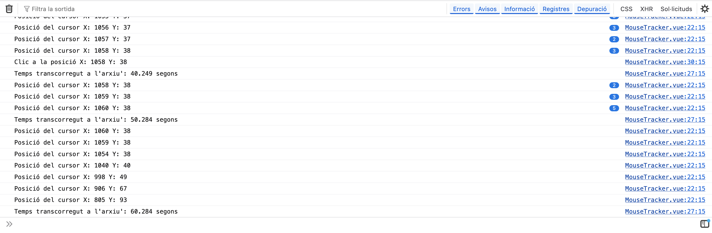

# +Rain Film Festival - Live section digital archive

A web application that opens up the creative processes behind live audiovisual and musical performances, originally part of the Live section at [+RAIN Film Festival](https://www.upf.edu/en/web/rainfilmfest), organised by Universitat Pompeu Fabra (Barcelona).


## 🕸️ Concept

The project is an expanded archive. It offers a multi-layered view of each audiovisual project. Users interact with different floating “layers” of information (video, text, imagery, artist metadata, etc.), which can be individually closed. This layered logic invites a nonlinear exploration of the materials and research lines, which include experimental practices and confrontations with AI systems.

In addition to manual navigation and keyword-based search, the interface records user interactions as a form of traceable behavior. These traces feed an automatic navigation system that activates after 5 minutes of inactivity,continuing the flow of discovery by repeating human interactions.

A second screen (or browser console) reveals details of user interaction, exposing elements often hidden beneath the interface.

## 🔍 Notes

- Currently implementing a backend with Node.js + Express.
- All content has been replaced with fictional materials due to copyright limitations.

## 🤜 Screenshots




## ⚙️ Technologies Used

- Vue 3 + Vue Router - Framework powering the app

- JavaScript (ES6+) – Component logic and user interaction.

- HTML5 & CSS3 – Custom styling, responsive layout.

- Modular Component Architecture.

- Inactivity & Interaction Tracking – Custom logic to monitor user actions and trigger automated navigation.


## 🛠️ Project Setup

Clone this repository.

Install dependencies:

```npm install```

Start the development server:

```npm run dev```

Open your browser and visit http://localhost:5173 (or the port shown in your terminal).